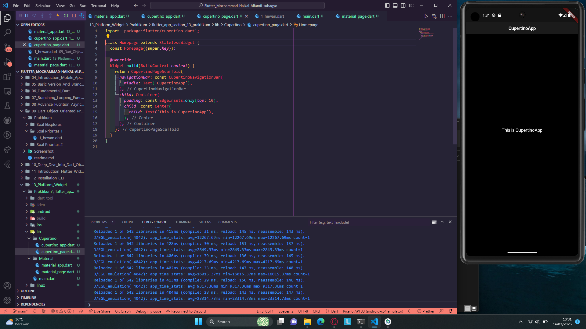

# Tugas Section 13 Platform Widget

## Soal Prioritas 1

### 1. Membuat tampilan OS Android (Material Design)
Screenshot  
 
Screenshot Drawer Open  
 

### 2. Setelah berhasil membuat sebuah tampilan OS Android dan di screenshot, ubah tampilan pada body aplikasi menjadi seperti dibawah ini menggunakan LISTVIEW!
Screenshot   
 

## Soal Prioritas 2

### 1. Membuat tampilan OS IOS (Cupertino Design)
Screenshot 
 

## Soal Eksplorasi

### 1. Masih pada aplikasi yang sama dengan tugas Material Design. Buatlah tampilan baru berdasarkan prototype
Screenshot
 

